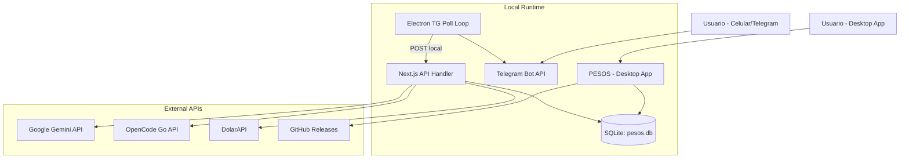

# 01-system-context — Contexto del Sistema

## Propósito
PESOS (Personal OS) es un sistema operativo personal diseñado para gestionar hábitos, finanzas personales y productividad diaria de forma 100% local. Su objetivo principal es ofrecer un entorno privado, libre de dependencias en la nube (a excepción de las APIs de IA externas optativas), e integrar un asistente conversacional que permita operar y resumir la actividad diaria del usuario.

## Responsabilidades
- **Productividad y Hábitos**: Registro y seguimiento de tareas diarias, hábitos repetitivos y reflexiones personales.
- **Gestión Financiera**: Registro de ingresos y gastos, conversión automática de transacciones en dólares a pesos utilizando cotizaciones del dólar MEP, y control de presupuesto mensual.
- **Progreso Gamificado (RPG)**: Sistema local que incentiva la constancia otorgando puntos de experiencia (XP) y niveles, desbloqueando logros conforme se completan tareas, reflexiones y hábitos.
- **Interfaz Conversacional (IA)**: Un chatbot en la interfaz gráfica y un bot de Telegram con soporte de voz que permiten consultar datos y registrar información en lenguaje natural.

## Dependencias
### Externas
- **Google Gemini API**: Utilizada para el asistente en lenguaje natural y la transcripción de notas de voz en el bot de Telegram.
- **OpenCode Go API**: Utilizada como proveedor alternativo opcional de IA para el chat (texto plano).
- **Telegram Bot API**: Canal para interactuar remotamente con el bot del sistema ("Pesito").
- **DolarAPI (`dolarapi.com`)**: API externa para la obtención en tiempo real de la cotización del dólar MEP (compra y venta) para su posterior conversión a pesos.
- **GitHub API**: Utilizada por el autoupdater para verificar releases y descargar actualizaciones del sistema.

### Internas
- **Node.js y Electron**: Motor de ejecución local y contenedor de ventana de escritorio.
- **SQLite (`better-sqlite3`)**: Base de datos local empotrada como motor principal de almacenamiento persistente.

## Restricciones conocidas
- **Mono-usuario**: El diseño de la base de datos local y los mocks de autenticación asumen que una única persona física utiliza la app por instalación.
- **Almacenamiento Local**: Los datos se almacenan en `~/.config/pesos/pesos.db`. La desinstalación automática o pérdida de acceso al directorio de configuración puede resultar en pérdida de datos si no hay respaldos.
- **Dependencia de Conectividad para IA/Bot**: El asistente de IA conversacional y el bot de Telegram no funcionan sin conexión a Internet o sin sus respectivas API keys provistas por el usuario.

## Decisiones arquitectónicas
1. **Local-First & Offline-First**: Almacenamiento local mediante una base de datos SQLite física instalada directamente en el directorio home del usuario.
2. **Dual-Layer (Mock Supabase sobre SQLite)**: El sistema utiliza interfaces de tipo idénticas a Supabase en el frontend y en las consultas, pero redirige toda la ejecución en el backend hacia sentencias SQLite crudas. Esto facilita la compatibilidad futura con servicios en la nube sin requerir cambios masivos de sintaxis.
3. **Long Polling Local en Desktop**: En lugar de configurar webhooks que requerirían IPs públicas fijas o túneles SSL (como ngrok), la aplicación de escritorio de Electron mantiene un bucle de *Long Polling* hacia Telegram y reenvía las peticiones internamente por HTTP POST al servidor local de Next.js.

## Diagrama Mermaid de Alto Nivel

## Pendientes de validación
- **Sync de Base de Datos**: Está pendiente validar cómo se gestionará la sincronización en caso de que en el futuro el usuario decida migrar sus datos locales a una instancia remota de Supabase real, dado que la capa cliente actual es puramente in-memory.
