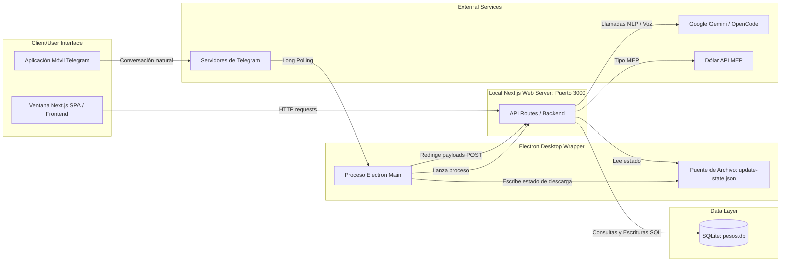

# 02-containers — Contenedores del Sistema

## Propósito
Describe los límites tecnológicos del sistema, identificando los contenedores de software que ejecutan código, almacenan datos o interactúan de manera independiente dentro de PESOS.

## Responsabilidades
- **Electron (Proceso Main)**: Coordina el ciclo de vida de la ventana de escritorio, inicializa el servidor local de Next.js en producción, administra la configuración local cargando `.env.local` en memoria, mantiene el bucle de polling de Telegram y gestiona las descargas de actualización mediante `electron-updater`.
- **Next.js (Frontend - Renderer)**: Interfaz gráfica SPA de usuario escrita en React. Renderiza el panel principal, calendarios, transacciones, registro de hábitos y reflexiones.
- **Next.js (Backend - API Routes)**: Proporciona la lógica del servidor de Next.js a nivel local (puerto 3000), respondiendo a peticiones del ChatBot del frontend, las notificaciones locales del actualizador, la sincronización de configuración y la recepción de eventos de webhook del bot de Telegram.
- **SQLite Database (`pesos.db`)**: Motor de base de datos empotrado en la ruta `~/.config/pesos/pesos.db`. Mantiene el esquema relacional para perfiles, tareas, hábitos, transacciones, reflexiones, estadísticas y logros.
- **Bot Daemon (`bot-daemon.js`)**: Proceso independiente que actúa como alternativa de polling sin interfaz (headless) para el bot de Telegram en ejecuciones de servidor/Docker.
- **IPC State Bridge (`update-state.json`)**: Archivo de texto utilizado como puente de persistencia y comunicación en tiempo de ejecución. Permite que el proceso de Electron (Main) escriba el progreso de actualización y que el servidor Next.js lo lea sin importar dependencias cruzadas de Electron que romperían las compilaciones del servidor.

## Dependencias
- **Electron Main** depende de: `electron`, `electron-updater`, `./updater.js`, `./updater-bridge.js`, Next.js binary.
- **Next.js Frontend** depende de: `@/lib/supabase-client` (para compilación), `lucide-react`, React.
- **Next.js Backend** depende de: `@/lib/supabase` (mock de base de datos), `better-sqlite3`, `@google/generative-ai`, `openai`, `crypto`.
- **Bot Daemon** depende de: Node fetch, `.env.local`.

## Restricciones conocidas
- **Acceso Directo a Base de Datos**: Solo el proceso servidor de Next.js (Backend API) puede acceder de forma directa y persistente a SQLite. El frontend tiene bloqueado el acceso debido a la política de ejecución del browser (`supabase-client.ts` resuelve a null).
- **Consumo de Memoria**: La coexistencia del proceso Electron Main, el servidor Next.js y el motor SQLite local consume una cantidad de recursos considerable en comparación con utilidades de terminal nativas, aunque se mantiene ágil para equipos modernos.
- **Actualizaciones en Linux (AppImage)**: Las actualizaciones directas in-app para AppImage tienen dependencias del entorno de ejecución del usuario (FUSE, permisos del directorio), por lo que se proveen scripts de actualización manual como salvaguarda en `scripts/update-appimage.sh`.

## Decisiones arquitectónicas
1. **Separación de Contextos de Ejecución**: Electron corre con `contextIsolation: true` y `nodeIntegration: false` para mitigar vulnerabilidades de inyección de código de terceros desde el motor web Next.js.
2. **File-based State Bridge**: Evita acoplar el Next.js build-time a las APIs nativas de Electron que no están presentes fuera del runtime del instalador.
3. **Caché en Memoria del Tipo de Cambio**: El contenedor Next.js API almacena en caché de memoria del servidor la cotización de dólar MEP con un TTL de 5 minutos, reduciendo peticiones innecesarias a `dolarapi.com`.

## Diagrama Mermaid de Containers

## Pendientes de validación
- **Cierre ordenado de subprocesos**: Validar en sistemas operativos alternativos (Windows / macOS) si el proceso de Next.js se destruye completamente al cerrar la app desde la bandeja de sistema (System Tray), evitando procesos huérfanos.
- **Permisos del Directorio de Base de Datos**: Pendiente verificar si en entornos multiusuario de un mismo sistema operativo el directorio `~/.config/pesos/` presenta colisiones de permisos.
