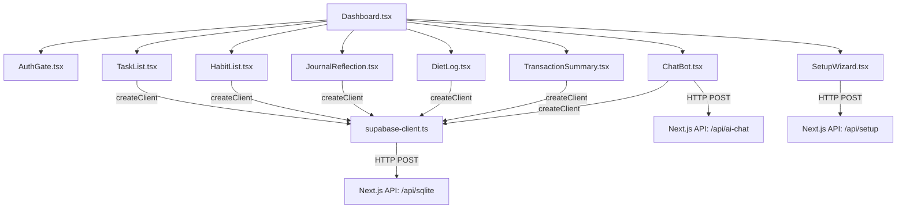

# 03-components — Componentes del Sistema

## Propósito
Desglosa los módulos y archivos de código que estructuran la lógica del frontend y backend de PESOS, detallando sus responsabilidades, dependencias y relaciones de comunicación.

## Responsabilidades
### Componentes Visuales (Frontend - `src/components/*`)
- **Dashboard.tsx**: Componente raíz del cliente. Coordina el menú lateral, carga de estados consolidados desde la base de datos simulada al arrancar, manejo del clima visual según el estado anímico o tareas completadas, y renderizado del estado del actualizador de Electron.
- **TaskList.tsx & TaskCalendar.tsx**: Permiten visualizar, crear, modificar el estado ('todo', 'done', 'ignored') y programar tareas en formato de lista y cuadrícula mensual.
- **HabitList.tsx**: Listado de hábitos diarios, cálculo del porcentaje de consistencia diaria y logging de ejecuciones.
- **JournalReflection.tsx**: Diario íntimo digital para registrar reflexiones en texto libre y asociar metadatos (estado de ánimo, etiquetas).
- **DietLog.tsx**: Registrador de calorías consumidas, macronutrientes (proteínas, carbohidratos, grasas), hidratación y peso del día.
- **TransactionSummary.tsx**: Panel financiero para ingresar transacciones de ingresos o gastos en pesos o dólares, consultar balances y comparar consumos contra el límite presupuestario mensual.
- **ChatBot.tsx**: Ventana de chat persistente con el asistente virtual para interactuar en lenguaje natural.
- **SetupWizard.tsx**: Flujo paso a paso para usuarios sin configuraciones previas (asistente para ingresar API keys).
- **AuthGate.tsx & AuthForm.tsx**: Barrera de seguridad que valida la cookie de sesión antes de habilitar las rutas privadas.

### Componentes de Servicio y Datos (Backend/Core - `src/lib/*` & `src/app/api/*`)
- **sqlite-db.ts (`runSQLiteQuery`)**: Motor local de ejecución relacional. Implementa el esquema relacional, gestiona los triggers de estadísticas RPG y calcula el desbloqueo de logros.
- **supabase.ts & supabase-client.ts**: Adaptadores del cliente Supabase. `supabase.ts` mapea consultas relacionales del backend a operaciones SQLite, mientras que `supabase-client.ts` es un stub de browser que simula el tipado retornando `data: null`.
- **ai-config.ts**: Almacena las preferencias de proveedor de IA ('gemini' o 'opencode') en el archivo local `~/.config/pesos/.ai-config.json`.
- **auth-gate.ts**: Genera y valida firmas de cookies de sesión usando códigos HMAC con una semilla criptográfica persistida en `~/.config/pesos/.auth-secret`.
- **API `ai-chat`**: Endpoint para el chat del Dashboard. Extrae el contexto actual del usuario (tareas pendientes, hábitos de hoy, transacciones financieras) y alimenta el prompt del modelo de lenguaje para una respuesta personalizada.
- **API `telegram`**: Endpoint webhook que procesa mensajes de texto y voz del bot "Pesito". Contiene un analizador conversacional y gestiona el flujo de confirmación transaccional (`CONFIRM_TX`).
- **API `exchange-rate`**: Provee las tasas MEP con revalidación e in-memory caching.
- **API `update`**: API expuesta al frontend Next.js para consultar el estado del actualizador y emitir comandos de instalación mediante el puente de ficheros.

## Dependencias
- Los componentes del Frontend (`Dashboard.tsx`, etc.) dependen estructuralmente de `supabase-client.ts` para resolver las firmas tipadas.
- La API de `ai-chat` y la de `telegram` dependen de `supabase.ts` para interactuar con los datos locales, y de `@google/generative-ai` y `openai`.
- Las APIs de `auth` y `setup` dependen de `auth-gate.ts` y `env-loader.ts` para la manipulación y resguardo de secretos del sistema local.

## Restricciones conocidas
- **Stubs de Frontend**: La dependencia del frontend respecto a `supabase-client.ts` causa que todas las grillas de la aplicación (tareas, hábitos, finanzas, estadísticas) muestren su estado vacío al renderizarse en el navegador real. La interacción de datos reales de lectura/escritura ocurre de forma indirecta por el chatbot que consulta las APIs del servidor, o bien por el bot de Telegram.
- **No-op limit/gte en consultas**: El parser SQLite en `sqlite-db.ts` ignora filtros avanzados como `.limit()` y `.gte()` (greater-than-or-equal) en ejecuciones reales, devolviendo siempre el set completo filtrado por igualdad (`eq`).

## Decisiones arquitectónicas
1. **RPG Engine embebido en DB**: La lógica de cálculo de niveles (`XP / 100 + 1`) y validación de logros se ejecuta directamente dentro del archivo de persistencia mediante consultas SQL preparadas de `better-sqlite3`, desacoplándola de los controladores de API individuales.
2. **Autenticación mediante HMAC local**: Se evita el almacenamiento de contraseñas de usuario tradicionales. La autenticación consiste en validar una cookie HMAC contra una llave única autogenerada de 32 bytes restringida al disco del equipo del usuario.

## Diagramas de Componentes

### Diagrama 1: Flujo en Frontend (Cliente)


### Diagrama 2: Backend y Persistencia
```mermaid
graph TD
    APIChat[Next.js API: /api/ai-chat] --> SubServerClient[supabase.ts]
    APITelegram[Next.js API: /api/telegram] --> SubServerClient
    APISqlite[Next.js API: /api/sqlite] --> SQLiteEngine[sqlite-db.ts]
    
    SubServerClient -->|Compila consultas| SQLiteEngine
    SQLiteEngine -->|Ejecuta SQL con better-sqlite3| SQLiteDB[(pesos.db)]
    
    subgraph RPG Progression System
        SQLiteEngine --> addXP[addXP]
        SQLiteEngine --> checkAch[checkAndUnlockAchievements]
        addXP & checkAch --> SQLiteDB
    end

    APITelegram -->|Llamada Gemini Voice / NLP| GoogleAI[@google/generative-ai]
    APIChat -->|Llamada IA| GoogleAI
    APIChat -->|Llamada OpenCode| OpenAI[openai]
```

## Pendientes de validación
*Ninguno identificado en esta sección. La comunicación cliente-servidor para SQLite está completamente implementada.*
