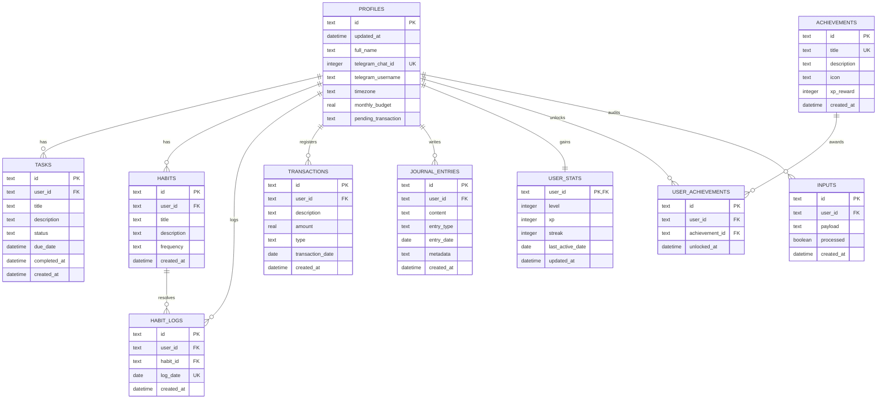

# 04-database — Modelo de Base de Datos

## Propósito
Detalla el modelo relacional físico implementado en SQLite para PESOS y su reflejo en el esquema lógico de la base de datos de producción Supabase (PostgreSQL).

## Responsabilidades
- **profiles**: Almacena los perfiles locales de usuario, incluyendo el nombre, zona horaria, configuración de Telegram (chat ID, username), presupuesto mensual y la transacción pendiente temporal para el bot.
- **tasks**: Registro de tareas de productividad del usuario, con soporte para fecha de vencimiento y estados ('todo', 'done', 'ignored').
- **habits & habit_logs**: Almacenan la definición de hábitos y el historial diario de ejecuciones de cada hábito.
- **transactions**: Registro financiero consolidado de ingresos y gastos.
- **journal_entries**: Guarda reflexiones diarias y registros dietéticos. Soporta metadatos en formato JSON (como calorías, macros, hidratación, peso y humor).
- **user_stats**: Estadísticas del motor RPG del usuario, tales como el nivel actual, puntos de experiencia (XP), racha de hábitos activa y la última fecha de actividad.
- **achievements & user_achievements**: Listado maestro de logros del sistema y el registro de logros desbloqueados por el usuario.
- **inputs**: Tabla de auditoría interna que almacena los payloads JSON crudos recibidos desde los webhooks de Telegram.

## Dependencias
- Toda la base de datos local SQLite tiene una relación de integridad referencial fuerte vinculada a la tabla `profiles` mediante llaves foráneas (`FOREIGN KEY(user_id) REFERENCES profiles(id)`).
- La tabla de `habit_logs` y `user_achievements` dependen de cascadas de eliminación (`ON DELETE CASCADE`) vinculadas a sus definiciones maestros (`habits` y `achievements` respectivamente).

## Restricciones conocidas
- **Check Constraints limitados en SQLite**: SQLite tiene soporte parcial para restricciones CHECK complejas, pero se aplican validaciones estrictas para los estados de tareas (`status IN ('todo', 'done', 'ignored')`), tipos de transacciones (`type IN ('income', 'expense')`), montos positivos en finanzas (`amount >= 0`), niveles RPG (`level >= 1`), y tipos de reflexiones (`entry_type IN ('journal', 'diet')`).
- **Persistencia de JSON**: En SQLite, el campo `metadata` de `journal_entries` y `payload` de `inputs` se guardan como cadenas de texto simples (`TEXT`), a diferencia de PostgreSQL donde se almacenan como tipos binarios estructurados `JSONB`. El mapeo del backend procesa la serialización y deserialización manual en JavaScript.

## Decisiones arquitectónicas
1. **Mock User ID estático**: Para el desarrollo de un entorno monousuario local-first sin forzar la autenticación, se utiliza un identificador UUID estático (`00000000-0000-0000-0000-000000000000`) para poblar el perfil por defecto y asociar todos los registros iniciales.
2. **Índices de unicidad compuesta**: Se utiliza un constraint de unicidad compuesto en `habit_logs(habit_id, log_date)` para asegurar que no se dupliquen registros de cumplimiento para un mismo hábito en un único día calendario.

## Diagrama Mermaid ER

## Pendientes de validación
- **Motor de Migraciones local**: Está **PENDIENTE DE VALIDACIÓN** la incorporación de un sistema formal de control de migraciones para la base de datos SQLite local (actualmente, el esquema se define en caliente al vuelo dentro de `sqlite-db.ts` con sentencias `CREATE TABLE IF NOT EXISTS`). Si se requiere cambiar un campo o agregar una tabla, no hay un historial de migraciones incremental aplicado localmente comparable al de `supabase/migrations/` en PostgreSQL.
