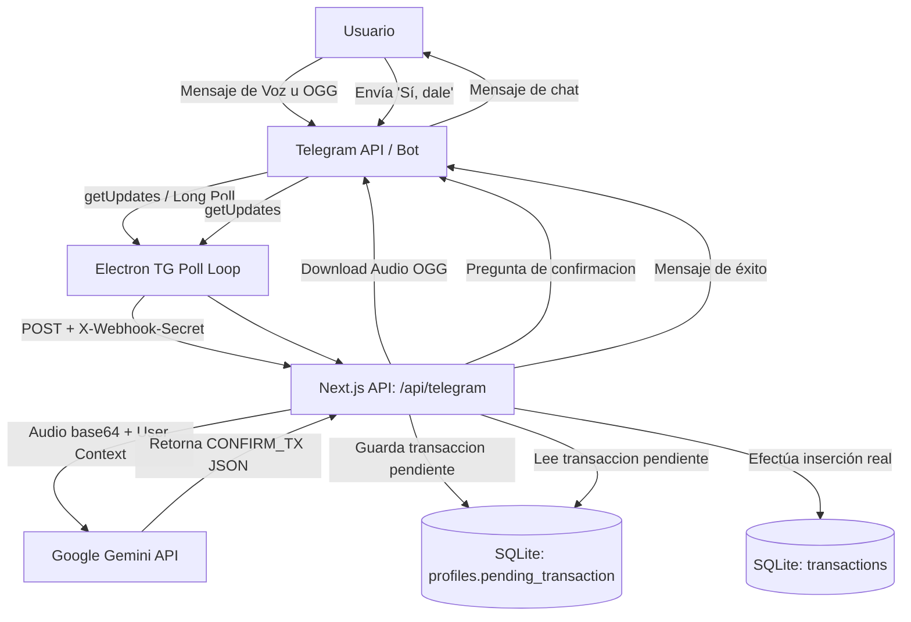

# 05-ai-agents — Agentes e Inteligencia Artificial

## Propósito
Describe los agentes de inteligencia artificial y flujos conversacionales integrados en PESOS, detallando cómo se estructuran sus prompts, qué herramientas consumen, y los flujos de comunicación con el motor de base de datos SQLite.

## Responsabilidades
### 1. Asistente Conversacional "Pesito" (Bot de Telegram)
- **Interfaz Conversacional Móvil**: Procesa mensajes en lenguaje natural e instrucciones de voz enviados por el usuario desde Telegram.
- **Registro Inteligente**: Identifica intenciones de gastos e ingresos, extrayendo el monto, la descripción, la moneda y el tipo de transacción para proponer un registro estructurado.
- **Auditoría de Ingesta**: Guarda cada payload crudo recibido en la tabla `inputs` antes de procesarlo para mantener trazabilidad ante fallos.

### 2. Chatbot del Dashboard (Asistente Integrado)
- **Asistente Contextual Local**: Responde consultas en lenguaje natural dentro de la interfaz de escritorio de PESOS.
- **Consolidador de Resúmenes**: Extrae resúmenes ejecutivos diarios sobre tareas completadas, porcentaje de hábitos alcanzados, y balance de gastos del mes corriente.

## Dependencias
- **Google Gemini API Key**: API key obligatoria para usar el bot conversacional por Telegram (y para transcripción de voz).
- **OpenCode Go API Key**: Alternativa configurable por el usuario para procesamiento de texto conversacional plano.
- **Telegram Bot Token**: Credencial del bot administrada a través del asistente de configuración de la app.
- **DolarAPI**: Utilizado por el bot de Telegram para convertir instantáneamente montos en dólares (USD) a pesos argentinos (ARS) mediante la cotización MEP del día.

## Restricciones conocidas
- **Asistente de Voz Exclusivo de Gemini**: Las notas de voz recibidas en Telegram son enviadas a Gemini en formato binario base64 con su tipo mime (`audio/ogg`), ya que OpenCode Go no soporta entradas multimedia (es solo texto). Si el usuario tiene configurado OpenCode Go como proveedor por defecto, el flujo de voz forzará una llamada a Gemini como fallback técnico obligatorio.
- **Sin Ejecución de Código**: Ambos agentes tienen prohibido explícitamente generar fragmentos de código de programación en sus respuestas, restringiéndose al idioma español informal con modismos argentinos.

## Decisiones arquitectónicas
1. **Flujo de Confirmación de Dos Pasos (`CONFIRM_TX`)**: Para prevenir registros erróneos en la base de datos por falsos positivos del LLM en lenguaje natural, el bot no inserta transacciones de forma inmediata.
   - En la primera interacción, el LLM detecta el gasto y responde con el prefijo estructurado: `CONFIRM_TX: {"amount": X, "currency": "Y", "description": "Z", "type": "expense"}`.
   - El webhook intercepta esta cabecera y guarda el objeto JSON temporalmente en el campo `pending_transaction` dentro de la tabla `profiles` del usuario.
   - El bot pregunta amigablemente al usuario si confirma la operación.
   - Al recibir confirmación afirmativa del usuario (e.g., "sí", "dale", "confirmar"), el webhook recupera el registro pendiente, realiza las conversiones monetarias necesarias si aplica, lo inserta en `transactions` y limpia el estado temporal en la base de datos.
2. **Inyección Dinámica de Contexto de Base de Datos**: Cada vez que el usuario escribe al chat o interactúa con el bot, el backend ejecuta consultas directas a SQLite a través de la interfaz Supabase server-side para recuperar el listado de tareas pendientes, hábitos completados y transacciones de los últimos 30 días, inyectándolas como cabeceras Markdown estructuradas en el System Prompt del modelo.

## Diagrama de Comunicación e Ingesta del Bot

## Pendientes de validación
- **Soporte Offline para IA**: Está **PENDIENTE DE VALIDACIÓN** el uso de modelos de lenguaje pequeños ejecutándose de forma 100% local (por ejemplo, Ollama, Llama.cpp, o WebLLM integrado en Electron) para lograr que el Chatbot y el análisis conversacional funcionen verdaderamente offline sin requerir claves de Google o OpenCode ni acceso a Internet.
