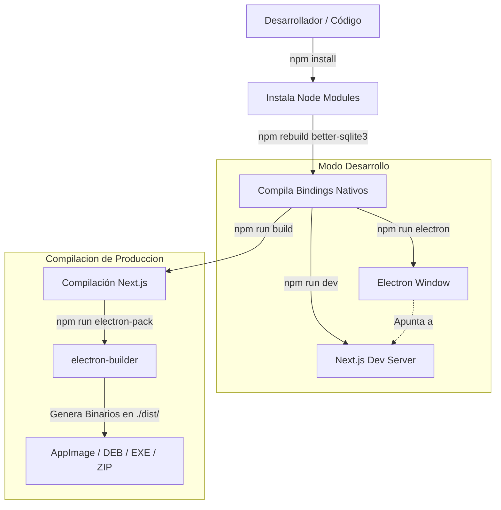
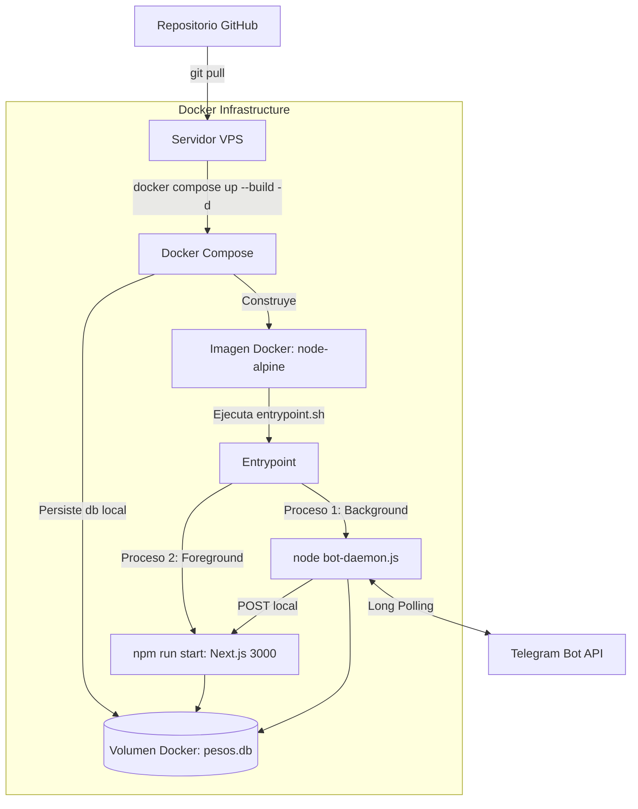

# 06-deployment — Despliegue y Distribución

## Propósito
Describe las distintas modalidades de ejecución, el proceso de compilación y empaquetado de instaladores de escritorio, y el despliegue del sistema en servidores VPS mediante contenedores Docker.

## Responsabilidades
- **Entorno de Desarrollo**: Provee un entorno de recarga rápida (HMR) ejecutando el servidor de desarrollo de Next.js y abriendo la ventana de Electron de forma paralela.
- **Compilador (`electron-builder`)**: Compila el código frontend estático, elimina dependencias de desarrollo y empaqueta ejecutables nativos para Linux, Windows y macOS.
- **Sistema de Actualización Automática (In-App Updater)**: Verifica actualizaciones contra el repositorio público de GitHub Releases y descarga e instala parches de forma transparente.
- **Docker Compose (Headless Deploy)**: Permite levantar la infraestructura del servidor de forma desatendida 24/7 para el bot de Telegram en VPS linux.

## Dependencias
- **Desarrollo**: Node.js v20+, npm v10+, bindings nativos compilados de `better-sqlite3`.
- **Empaquetado**: `electron-builder` en modo local, requiriendo dependencias nativas del sistema de destino (`libnss3`, `libatk1.0-0`, etc. en distribuciones basadas en Debian/Ubuntu).
- **Despliegue Docker**: Docker Engine, Docker Compose.

## Restricciones conocidas
- **Code Signing Ausente**: Los ejecutables generados para Windows (`.exe`) y macOS (`.app` / `.zip`) no poseen firmas digitales válidas de desarrollador.
  - En Windows: Salta la pantalla de alerta de Microsoft SmartScreen ("Windows protegió su PC") la primera vez.
  - En macOS: macOS Gatekeeper bloquea la app ("no se puede abrir porque el desarrollador no se puede verificar"). El usuario debe forzar la apertura vía clic derecho o quitando la cuarentena mediante comandos `xattr`.
- **Instalación de FUSE en Linux**: La versión empaquetada como AppImage requiere que la distribución de Linux del usuario tenga instalada la biblioteca `fuse2` (o `libfuse2`), de lo contrario la aplicación de escritorio fallará al intentar montarse e iniciar.

## Decisiones arquitectónicas
1. **Actualización Automática Desacoplada**: El actualizador de Electron (`updater.js`) escribe estados atómicos en `update-state.json`. Esto permite que Next.js consulte el estado de la actualización y envíe señales para iniciar descargas o reinicios escribiendo peticiones en archivos específicos (`update-check-request`, `update-download-request`, etc.), evitando el acoplamiento directo de llamadas IPC de Electron.
2. **Docker de Doble Proceso (Entrypoint Script)**: El Dockerfile utiliza una imagen ligera basada en `node:20-alpine` y define un `entrypoint.sh` a medida que lanza el demonio del bot de Telegram (`bot-daemon.js`) en segundo plano antes de levantar el servidor web de Next.js en primer plano.

## Diagramas de Despliegue

### Flujo 1: Desarrollo y Empaquetado Local

### Flujo 2: Despliegue Headless en Servidor (VPS)

## Pendientes de validación
- **Automatización CI/CD (GitHub Actions)**: Está **PENDIENTE DE VALIDACIÓN** la configuración de un pipeline de integración y despliegue continuo (CI/CD) automatizado a través de GitHub Actions que compile automáticamente las versiones para todas las plataformas, asocie las firmas (en caso de adquirir certificados) y publique directamente los instaladores finales en los assets de GitHub Releases ante tags de nuevas versiones.
- **Monitoreo de Procesos en Docker**: Validar si en caso de que el proceso secundario `bot-daemon.js` muera dentro del contenedor por un fallo crítico, el contenedor Docker de Next.js es capaz de reportarlo o reiniciarse automáticamente (actualmente el script `entrypoint.sh` no supervisa activamente el PID del bot tras lanzarlo).
