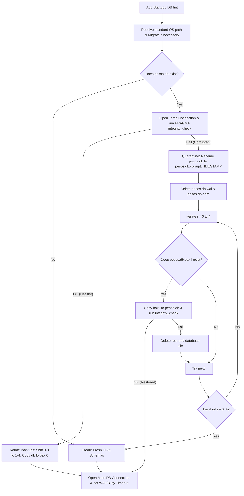

# Technical Design: SQLite Infallible Persistence

This document details the architectural decisions, data flow, and file changes required to implement platform-standard database persistence, multi-level rolling backups, auto-recovery (self-healing), and Write-Ahead Logging (WAL) concurrency optimizations.

---

## 1. Technical Approach

To eliminate database lock contentions and protect against corruption failures, the application's storage architecture will be refactored as follows:
* **Centralized Path Resolution**: A new module `src/lib/paths.ts` will dynamically resolve standard OS directories, ensuring files are placed in standard paths while supporting fallback migration from legacy paths.
* **Boot-Time Self-Healing & Backup Rotation**: On start, the system executes a temporary connection check running `PRAGMA integrity_check`. If healthy, the system performs a rolling shift of the 5 backups (`.bak.0` through `.bak.4`) and makes a fresh backup. If corrupt, it quarantines the file and recovers from the newest healthy backup (searching 0 through 4), reverting to a fresh database only if all else fails.
* **Concurrency Configuration**: Pragmas for WAL mode (`PRAGMA journal_mode = WAL`) and busy timeout (`PRAGMA busy_timeout = 5000`) are applied on every connection.

---

## 2. Architecture Decisions

### Decision: Centralized App Data Directory
* **Choice**: Resolve directory using Node's `os` and `process` modules:
  * **Linux**: `$XDG_DATA_HOME/pesos` (falls back to `~/.local/share/pesos`).
  * **macOS**: `~/Library/Application Support/pesos`.
  * **Windows**: `%APPDATA%/pesos` (falls back to `~/AppData/Roaming/pesos`).
* **Rationale**: Replaces the hardcoded `~/.config/pesos` directory to align with platform-specific application standards.
* **Legacy Fallback**: If the legacy directory `~/.config/pesos` contains existing data (e.g. `pesos.db`) and the new directory does not, files are automatically copied to the new path to prevent user data loss.

### Decision: In-Memory / Temporary Integrity Verification
* **Choice**: Use a separate lightweight connection to perform `PRAGMA integrity_check` before opening the main connection or executing a backup copy.
* **Rationale**: Opening the main database handle directly might cause a crash on initialization if the database is corrupt. Verifying via a temporary handle allows clean error handling and redirection to the recovery flow.

### Decision: Shift-Based Backup Rotation
* **Choice**: Rotate backups by shifting filenames from `pesos.db.bak.3` down to `pesos.db.bak.0` up to `pesos.db.bak.4` using `fs.renameSync` before copying the current database file to `pesos.db.bak.0`.
* **Rationale**: Avoids costly duplication and ensures the latest 5 backups are kept in order of age.

---

## 3. Data Flow



---

## 4. File Changes

### `src/lib/paths.ts` (New)
* Centralizes resolving standard OS directories. Exports `getAppDir()` which determines the target path based on `os.platform()`.
* Handles directory tree creation.
* Implements the backward-compatible migration of `pesos.db`, `.env.local`, and `.ai-config.json` from `~/.config/pesos` to the new path if the new path does not contain `pesos.db`.

### `src/lib/sqlite-db.ts` (Modified)
* Uses `getAppDir()` to locate the database files.
* Implements the self-healing and backup rotation loop during the startup sequence before exposing `db`.
* Applies `PRAGMA journal_mode = WAL` and `PRAGMA busy_timeout = 5000` to the database connection.
* Ensures proper deletion of `-wal` and `-shm` files during quarantine to prevent stale state interference.

### `src/lib/ai-config.ts` (Modified)
* Replaces path resolution for `.ai-config.json` with `getAppDir()`.

### `src/lib/env-loader.ts` (Modified)
* Replaces path resolution for `.env.local` with `getAppDir()`.

---

## 5. Interfaces/Contracts

### Path Resolution Module (`src/lib/paths.ts`)
```typescript
export function getAppDir(): string;
```

---

## 6. Testing Strategy

Unit and integration test suites will be written in Vitest to verify all resilience behaviors:
1. **Path Resolution Test**: Mock `os.platform()` and environmental variables (`process.env.APPDATA`, `process.env.XDG_DATA_HOME`) to assert correct pathing on Windows, macOS, and Linux.
2. **Backup Rotation Test**: Mock filesystem actions and verify `fs.renameSync` moves `pesos.db.bak.0` through `pesos.db.bak.4` sequentially and limits history to 5 backup files.
3. **Self-Healing Test**: 
   * Simulate a corrupted database file, assert quarantine renaming works (including `-wal`/`-shm` cleanup), and assert that the most recent healthy backup is successfully restored.
   * Verify that if all backups are corrupt, a clean database instance is successfully created.
4. **WAL Mode Connection Test**: Verify the connection is initialized with WAL mode active and a 5000ms busy timeout.

---

## 7. Rollout/Migration

* **Upgrade Safety**: On startup, if files are found in `~/.config/pesos` but not in the new directory, they will be copied automatically, ensuring a seamless user upgrade path.
* **No Database Migrations Required**: The changes affect filesystem persistence wrapper layers only; the schemas remain unchanged.
