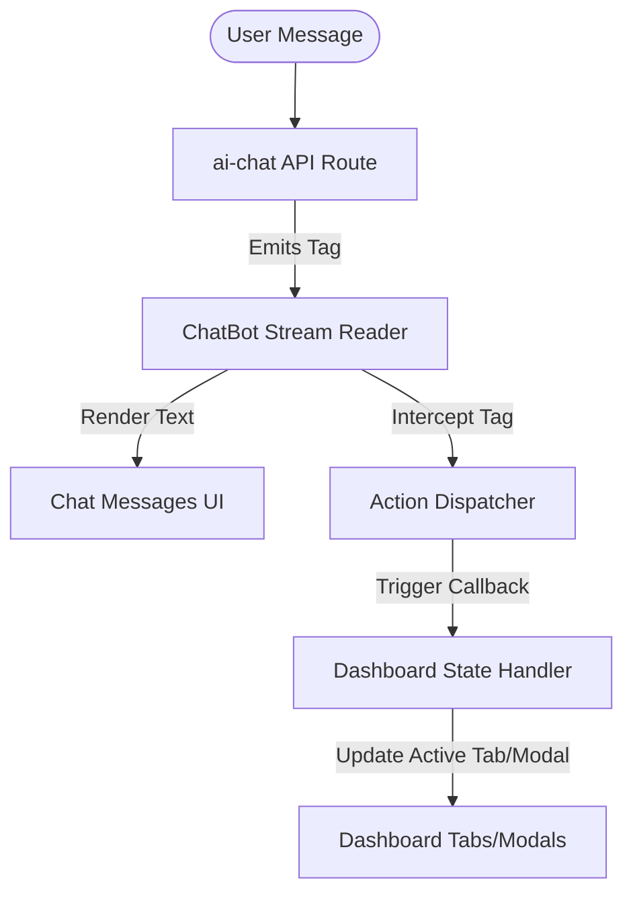

# Design: UI/UX Refinement (ui-ux-refinement)

## 1. Technical Approach
This specification details the implementation of interactive `<run_action>` tags generated by the AI assistant and executed client-side, along with visual upgrades across the core features of the PESOS dashboard.

The technical approach comprises:
- **AI Action Invocation**: Update the system prompt in `src/app/api/ai-chat/route.ts` to instruct the AI to emit structural XML tags (e.g., `<run_action type="navigate" tab="diet" />`) when resolving user requests.
- **Client-Side Interception**: Modify `src/components/ChatBot.tsx` to parse these tags out of the response stream using a regex engine, executing callback handlers while rendering clean text to the user.
- **Visual & Feature Enhancements**: Implement dynamic, tactile, and gamified features in the 6 main view components (`Dashboard.tsx`, `TaskList.tsx`, `HabitList.tsx`, `JournalReflection.tsx`, `DietLog.tsx`, `TransactionSummary.tsx`).

---

## 2. Architecture Decisions

### Decision 1: Stream Parsing of `<run_action>` Tags
- **Choice**: Parse tags at the stream level or immediately following stream termination via regex `/`<run_action\s+type="([^"]+)"\s*(.*?)\s*\/>/g`.
- **Rationale**: Immediate execution on stream-complete avoids layout jumping. Intercepted actions are dispatched to a unified action handler.

### Decision 2: Weather Overlay using Canvas Particles
- **Choice**: Implement a lightweight HTML5 `<canvas>` rendering loop inside the dashboard container, controlled by the active `weatherState`.
- **Rationale**: Canvas is highly performant compared to rendering hundreds of DOM elements for rain/clouds/stars, ensuring 60FPS fluid animation without impacting React render cycles.

---

## 3. Data Flow

### AI Action Execution


---

## 4. File Changes

### 4.1. `src/app/api/ai-chat/route.ts`
- **System Prompt**: Add instructions allowing the AI to use `<run_action type="navigate" tab="overview|tasks|habits|journal|diet|finances" />` or `<run_action type="open_modal" modal="close_day" />`. Explain that these must be written inline when the user asks to switch views or close their day.

### 4.2. `src/components/ChatBot.tsx`
- **Props**: Add `onExecuteAction?: (action: { type: string; [key: string]: any }) => void`.
- **Stream Interception**: During streaming, strip `<run_action ... />` tags from the visible text. On stream completion, parse the tags and invoke `onExecuteAction`.

### 4.3. `src/components/Dashboard.tsx`
- **Weather Canvas**: Add a canvas element matching container bounds. Implement particle classes for:
  - `sunny`: Drifting golden dust/sparkles.
  - `cloudy`: Slow, large gray mist puffs.
  - `stormy`: Fast-dropping blue lines (rain) and random screen flash (lightning).
- **RPG Achievements**: Add a slide-over deck list displaying custom achievement locks/unlocks.
- **Close Day Modal**: Add a summary overlay displaying:
  - Tasks: Completed vs Todo.
  - Habits: Completion % grid.
  - Finances: Total Net Income/Expense.
  - Journal: Today's selected mood emoji.

### 4.4. `src/components/TaskList.tsx`
- **Confetti**: Mount a lightweight canvas-confetti burst animation triggered on status changes to `done`.
- **Snooze**: Add a "Snooze" button next to tasks that increments the task's `due_date` by +24h or +1h via Supabase.
- **Category Tags**: Add a selector pill in the task creation form storing categories in the metadata array.

### 4.5. `src/components/HabitList.tsx`
- **7-Day Grid**: Render a tiny 7-column horizontal indicator tracking completed logs over the last 7 calendar days.
- **Streak Flame**: Calculate streaks by counting consecutive days backward from today. Display a pulsing orange flame icon if streak > 0.

### 4.6. `src/components/JournalReflection.tsx`
- **Prompts Drawer**: Add a side-draw drawer with random prompt suggestions (e.g., *"¿Qué aprendí hoy?"*).
- **Mood Sparkline**: Render a small SVG line chart tracking numeric mood values over the last 10 entries.

### 4.7. `src/components/DietLog.tsx`
- **Macro status color**: Update protein, carbs, and fat progress bars. Colors shift: `sky-400` (within limit) to `amber-500` (exceeding limit).
- **Water Cup Animation**: Render an SVG cup with an interior rect whose height dynamically animates based on daily water intake % against target.

### 4.8. `src/components/TransactionSummary.tsx`
- **Pie Chart**: Build a custom CSS conic-gradient or SVG-based pie chart depicting expense share by category.
- **MEP Calculator**: Add an ARS to USD MEP calculator that fetches/uses the active exchange rates to convert transaction totals.

---

## 5. Interfaces & Contracts

### Action Tag Schema
```typescript
interface ActionPayload {
  type: 'navigate' | 'open_modal';
  tab?: 'overview' | 'tasks' | 'habits' | 'journal' | 'diet' | 'finances';
  modal?: 'close_day';
}
```

---

## 6. Testing Strategy

### Automated Verification
- **Unit Testing**: Run `npm run test` or check component compilation to verify props interface updates.
- **Integration**: Validate regex accuracy in `ChatBot.test.tsx` against multiple string inputs including malformed tags.

### Manual Scenarios
1. **AI Navigation**: Ask the bot: *"Mostrame mis finanzas"*. Verify the active tab changes to the finances tab automatically.
2. **Confetti & Snooze**: Complete a task and check for particle bursts. Click snooze and verify due date updates.
3. **Canvas Performance**: Run rendering loops and monitor browser CPU to confirm particle logic stays below 3% CPU.
